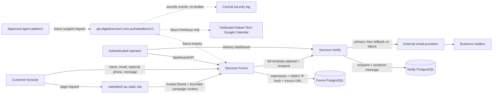

# Digital Sanctum readiness assessment for Naked Tech actions

**Assessment date:** 1 August 2026
**Remediation verification:** 2 August 2026
**Decision:** **No-go for Phase 3 implementation until the blocking controls in this report are complete**
**Scope:** Read-only assessment plus separately approved remediation verification for the Naked Tech website, Sanctum Forms, Sanctum Notify, the shared production host, public DNS/TLS, notification delivery, storage, monitoring, retention and proposed Google Calendar use.

This is an engineering and privacy-readiness assessment, not legal advice. The Privacy Act, Notifiable Data Breaches scheme, Spam Act, Australian Consumer Law, record-keeping requirements, and all proposed customer-facing wording require review by qualified Australian advisers before external transactional access is enabled.

## Executive decision

Phase 1's public catalogue can remain live. It does not create bookings or accept customer data through a new API.

Do not implement or enable the Phase 3 action API yet. The present platform successfully receives Naked Tech enquiries and sends owner notifications, but it is not ready to become a shared action plane for approved agents.

The 2 August remediation closed the original Forms audience/role vulnerability, caller-selected PAT tenant vulnerability, unbound Forms-to-Notify key, missing Notify dashboard role check, client-side OAuth refresh-token exposure, PostgreSQL backup/restore blocker, indefinite live retention in Forms and Notify, application logging of recipient/provider-error PII, and unbounded operational-log age. Forms/Notify retention migrations, dry-run commands, legal-hold exclusions and bounded timers are deployed; reviewed production dry-runs and a staged execution passed, both daily timers are enabled, both applications now emit bounded notification diagnostics without recipient addresses or provider response bodies, and journald retains no more than 30 days or 500 MB. The remaining blockers are:

1. The retention schedule still requires qualified legal approval, provider/mailbox deletion procedures and an end-to-end data-subject workflow.
2. Forms and Notify run as the same human operating-system account on a host shared with many applications.
3. Notify still duplicates full customer payloads during its active retention period; provider/mailbox lifecycle controls and the provider register remain incomplete.
4. No dedicated Naked Tech Google Calendar, Calendar API credential, free/busy integration, or calendar-specific monitoring was found.
5. `api.digitalsanctum.com.au` is not provisioned. `nakedtech.au/api` is already proxied to an unrelated Next.js application and must not be reused.

The existing human form can continue while these controls are remediated. The current form is active, origin-limited, public, has no file field, no webhook, and no automatic respondent receipt. Its trusted `postMessage` contract and analytics behaviour should remain unchanged during future migration.

## Evidence and boundaries

### Repositories and deployed versions

| Component | Audited source | Deployed commit | State during audit |
|---|---|---:|---|
| Naked Tech | `/home/preginald/Dev/nakedtech` | `eb6d721d85a51d109b6bccc9ea12c4149477b61d` | Phase 1 and this readiness assessment deployed; unrelated local marketing work preserved |
| Sanctum Forms | `/home/preginald/Dev/sanctum-forms` | `4fe8977d1b44db8651f51d1a5b33d46b01a4394a` | Auth, retention and PII-safe notification logging remediation deployed; CI and production service healthy |
| Sanctum Notify | `/home/preginald/Dev/sanctum-notify` | `f7afc3f58d6e01986eefaa6ea492bc327edfcb7b` | Scoped-auth, deterministic CI, retention and PII-safe diagnostic remediation deployed; production service healthy; unrelated local untracked files not touched |
| Sanctum Monitor | `/home/preginald/Dev/sanctum-monitor` | `6cd11730b962f69faabe16d60c803f2b97a8f0f8` | Backup/restore controls and bounded journald policy deployed; Monitor and public service health checks passed; unrelated untracked files not touched |
| Sanctum Core | `/home/preginald/Dev/DigitalSanctum` | inspected read-only | Existing unrelated branch/worktree changes not touched |
| Current `/api` target | `/opt/chore-quest` on production | not part of this assessment | Next.js process on port 3000; unrelated to Naked Tech actions |

The original assessment was read-only. The separately approved 2 August remediation changed Forms and Notify authentication, migrated the production Forms-to-Notify credential, revoked the legacy unbound key, repaired Notify CI, established PostgreSQL recoverability, deployed production retention controls, and removed recipient/provider-error PII from notification diagnostics. It did not add an action API, Calendar access, customer fields, booking behaviour or payment capability. Follow-up aggregate database queries and retention evidence deliberately excluded message bodies, contact details, credentials and other personal information.

### Live edge and host observations

- `nakedtech.au`, `forms.digitalsanctum.com.au`, `notify.digitalsanctum.com.au`, and `auth.digitalsanctum.com.au` resolve to the shared production host.
- `api.digitalsanctum.com.au` and `api.nakedtech.au` do not resolve.
- Apex Naked Tech, Forms, and Notify serve valid Let's Encrypt certificates. Automated Certbot renewal is active.
- Naked Tech's Nginx vhost proxies `location /api` to `127.0.0.1:3000`; that process is Chore Quest, not Sanctum Forms or a Naked Tech API.
- Forms and Notify listen only on loopback and are proxied through Nginx. PostgreSQL listens only on loopback.
- Forms and Notify health endpoints returned healthy responses and their deployed Git commits matched the audited sources.
- Fail2ban, unattended upgrades, the firewall, Sanctum Monitor, and the monitor agent are active. The dedicated 30-second API/MCP health timers are installed but disabled.
- Host journald now retains the shorter of 30 days or 500 MB, rotates journal files daily and compresses them. The root-owned production drop-in is version-controlled in Sanctum Monitor.
- Forms and Notify both run as `preginald`, rather than isolated service users.
- Generic PostgreSQL `pg_basebackup@` and `pg_dump@` units remain disabled and inactive. Restic 0.12.1 now writes encrypted logical backups to the private `digital-sanctum-backups` Space in Sydney; the recovery password is retained in the operator's KeePassXC database and a protected production copy.
- The PostgreSQL recoverability boundary is the whole cluster: eight application databases, the administrative `postgres` database, and cluster globals/role ownership. The live logical data set produced a 156.9 MiB encrypted Restic snapshot during the temporary drill.

Absence of host-visible evidence does not prove that provider-level snapshots do not exist. DigitalOcean account-level backup/snapshot settings must be verified separately, but snapshots alone would not replace a tested, encrypted, database-consistent backup and restore procedure.

### Current Naked Tech form facts

At the time of the audit, the `nakedtech-contact` form was:

- active and public;
- limited to `https://nakedtech.au`, the Forms origin, and a localhost development origin;
- composed of required name, email and message fields, plus optional phone;
- using the default 10 submissions per minute, per endpoint and derived client IP;
- configured without file upload, webhook, respondent receipt, or calendar operation; and
- holding 9 submissions and 0 server-side drafts.

These counts are point-in-time operational facts, not catalogue promises. No submission content was read.

The page currently returns both `Content-Security-Policy: frame-ancestors *` and `X-Frame-Options: DENY`. Modern browsers generally prioritise CSP, but the headers express conflicting policies and should be made consistent with an explicit allowlist before the form contract is changed.

### Current Notify facts

- Resend, Brevo, Mailjet, and SMTP are configured in production. The application tries them in that order, so data may be disclosed to fallback providers after delivery failure.
- The Forms credential now maps to active key `sanctum-forms-v2`, bound to the Digital Sanctum/Naked Tech account with only `notify:create`. The legacy unbound `sanctum-forms` key is inactive.
- The unscoped notification pool held 197 records: 147 sent and 50 dead-letter, dated from 29 March to 29 July 2026.
- That historical aggregate includes multiple Forms users. It remains unsegregated and cannot be attributed to Naked Tech by tenant without examining personal payloads, which this audit did not do. New Forms notifications are tenant-bound.
- Deployed Notify persists recipient, reply-to and complete template data while delivery is active, then the production retention timer scrubs personal content 30 days after terminal status and deletes terminal delivery rows after 90 days. This bounded lifecycle is deployed, but the full Forms payload remains duplicated in Notify during the active retention period.

## Current and proposed data flow

The future API must be a separate trust boundary. It must not inherit current Forms operator credentials, the Forms-to-Notify credential, dashboard sessions, or Naked Tech's existing `/api` namespace.

## Data inventory and purpose test

| Data | Current location/disclosure | Necessary purpose | Phase 3 decision |
|---|---|---|---|
| Public service facts | Naked Tech build and `/services.json` | Explain available services and price/scope | Public, cacheable; no customer data |
| Name | Forms, Notify payload, email provider/mailbox | Address and respond to an enquiry | Collect for enquiry/booking request only |
| Email or phone | Forms, Notify payload/recipient, provider/mailbox | Reply using the requested channel | Require at least one, not both; phone remains optional otherwise |
| Free-text message | Forms, Notify payload, provider/mailbox | Understand the problem and suitability | Bound length; warn against credentials/sensitive information; never put in operational logs |
| Service ID | Forms context or future API | Route and assess enquiry | Use stable public service ID; validate against active catalogue |
| Postcode | Future eligibility request | Determine service area | Validate Australian postcode; do not require an exact address for eligibility |
| Preferred slot | Future booking request | Ask the human operator to review timing | Store only with linked enquiry and confirmation evidence; never imply confirmation |
| Calendar busy intervals | Future Google free/busy response | Calculate candidate windows | Do not store event titles, attendees, descriptions or identifiers; do not expose raw calendar ID |
| Campaign/page context | Forms submission and owner notification | Attribution and enquiry context | Keep the existing six-field allowlist and byte cap; no arbitrary query parameters |
| Source URL | Forms submission | Security and attribution | Store canonical origin/path only; strip query and fragment before future writes |
| IP-derived data | Nginx logs and Forms HMAC hash | Abuse prevention and security | Trust only the reverse proxy; rotate HMAC key under a documented schedule; define expiry |
| Agent/platform identity | Future API security event and request metadata | Accountability and user-authority evidence | Registered client ID and platform name; no model chain-of-thought or unrelated conversation |
| Confirmation evidence | Future booking request | Prove the customer reviewed the exact action | Structured summary hash, timestamp, actor and channel; no audio/transcript by default |
| Marketing consent | Not currently collected | Future optional marketing only | Separate, unticked, versioned consent; never infer it from an enquiry |

OAIC's current APP 3 guidance says collection should be relevant, minimal and not excessive, and that “helpful” or potentially useful later is not enough. The proposed API should apply this standard even if qualified advice concludes the small-business exemption applies. See [OAIC APP 3 guidance](https://www.oaic.gov.au/privacy/australian-privacy-principles/australian-privacy-principles-guidelines/chapter-3-app-3-collection-of-solicited-personal-information).

## Privacy impact assessment

### People and reasonable expectations

The principal affected group is household customers, including people who may be older, experiencing technology stress, or responding to suspected scams. Contact messages can unintentionally contain sensitive account, health, financial or family information even though the form warns against it. Agent-originated submissions add a risk that a platform sends more conversation context than the customer expects.

Reasonable expectations are:

- a human reviews an enquiry or booking request;
- an enquiry does not create a contract, appointment or charge;
- availability reveals candidate times, not private calendar details;
- information goes only to the systems and providers needed to respond;
- the business can find, correct and delete information it no longer needs; and
- an agent cannot widen scope, accept terms or confirm a booking without fresh customer confirmation.

### Privacy risks and required treatments

| Risk | Inherent risk | Required treatment | Residual target |
|---|---:|---|---:|
| Agent submits unrelated conversation or sensitive credentials | High | Strict schemas and lengths; prohibited-data detector; customer-facing review screen; reject password/code/financial-secret patterns; no arbitrary attachments | Low–medium |
| Full form payload duplicated in Forms, Notify, provider and mailbox indefinitely | High | Minimise Notify template data, content expiry, mailbox retention process, provider contracts/settings, verified deletion | Medium |
| Cross-tenant or wrong-audience operator access | Critical | Audience enforcement, scoped OAuth/API credentials, role checks, tenant-isolation tests and security-event alerts | Low |
| Calendar reveals private event data | High | Dedicated calendar; `calendar.events.freebusy` or another least-privilege free/busy scope; transform to windows in memory; never return calendar keys or event metadata | Low |
| Booking request is mistaken for confirmation or acceptance | High | `pending_review` only; consequence classification; exact confirmation summary; human confirmation; plain-language status and expiry | Low |
| Marketing consent is inferred from service contact | Medium | Separate optional consent object and evidence; service messages and marketing lists kept separate; unsubscribe controls before any campaign | Low |
| Data-subject request cannot be fulfilled across copies | High | Data map, stable enquiry ID, search/export/delete workflow across Forms, Notify and backups, provider deletion verification | Medium |
| Provider overseas processing is unclear | Medium–high | Record active provider/subprocessor locations, contracts and fallback behaviour; update privacy notice after legal review | Medium |
| Small-business exemption is assumed incorrectly | High | Qualified Australian legal determination, documented and reviewed on turnover/service changes; operate to APP-aligned baseline regardless | Low–medium |

Most small businesses with annual turnover of $3 million or less are exempt, but the exemption has exceptions and turnover includes income from all sources. Applicability cannot be determined from source code. See the [OAIC small-business guidance](https://www.oaic.gov.au/privacy/privacy-guidance-for-organisations-and-government-agencies/organisations/small-business). If the Privacy Act applies, the NDB scheme applies to eligible breaches; an entity must take reasonable steps to complete a suspected-breach assessment within 30 calendar days. See the [OAIC NDB guidance](https://www.oaic.gov.au/privacy/notifiable-data-breaches/preventing-preparing-for-and-responding-to-data-breaches/data-breach-preparation-and-response/part-4-notifiable-data-breach-ndb-scheme).

### Privacy conclusion

The proposed operations can be proportionate if the action API becomes the minimising façade, rather than a new route that copies arbitrary agent messages into today's storage chain. Eligibility and availability should be ephemeral. Enquiries and booking requests should persist only the fields needed for human action and audit. No customer write should be enabled before deletion works across every durable copy.

## Threat model

### Trust boundaries

1. Public customer/agent to the future edge API.
2. Edge API to its own action service and database.
3. Action service to Forms during migration.
4. Forms to Notify.
5. Notify to external mail providers.
6. Action service to Google Calendar.
7. Operator browser to OIDC, Forms and Notify dashboards.
8. Each service/process to the shared host, filesystem and PostgreSQL cluster.

### Findings

| ID | Severity | Finding and evidence | Required before Phase 3 |
|---|---:|---|---|
| AUTH-01 | Resolved | Forms now verifies the configured `sanctum-forms` audience and requires an authorised operator role; missing-role and audience-path tests pass. | Keep issuer/signature/expiry/audience and negative tests in CI. Add service-specific roles if the shared `admin` role is later considered too broad. |
| AUTH-02 | Resolved for current API | Production PATs are bound server-side to one Forms account. `X-Account-Id` may match the binding for compatibility but cannot select or widen it; mismatch tests and live denial pass. | Do not reuse this compatibility PAT design for Phase 3 clients; use registered, hashed, rotatable client credentials with explicit scopes. |
| AUTH-03 | Resolved | Forms uses a tenant-bound Notify key with only `notify:create`; the old unbound key is revoked. Live probes proved create-only access, read denial and unbound denial without persisting a notification. | Decide whether historical unscoped records can lawfully be segregated, de-identified or deleted. |
| AUTH-04 | Resolved | Notify requires `notify:admin` at OIDC callback and on every dashboard session check. Missing roles are denied and session state is cleared. | Add central access/security-event auditing and alerts before Phase 3. |
| AUTH-05 | Resolved | Notify no longer stores access or refresh tokens in the signed cookie. It stores identity/roles with an eight-hour local expiry and requires fresh OIDC login after expiry. | Retain bounded-session, role-denial and expiry tests; define emergency session invalidation procedure. |
| DATA-01 | Partial | Production Forms/Notify migrations and bounded enforcement jobs hard-delete expired records, scrub Notify content first, exclude legal holds and default to dry-run. Reviewed dry-runs, staged execution and timer enablement are complete; provider/mailbox/data-subject workflows remain absent. | Obtain legal approval and implement provider/mailbox traversal and end-to-end deletion tests. |
| DATA-02 | High | Notify persists the complete form payload after rendering, duplicating customer messages until the proposed 30-day scrub. | Pass only template-required values, deploy rapid content expiry, and retain delivery metadata separately. |
| DATA-03 | Partial | Production retention enforcement expires anonymous server drafts after seven days, but draft routes still do not repeat form status/origin checks and accept unbounded, unvalidated JSON payloads. | Add status/origin/auth checks, schema/size limits and rate limits, or disable server drafts for Naked Tech. |
| OPS-01 | Resolved | Encrypted off-host logical backups, documented RPO/RTO, freshness monitoring and an isolated nine-database restore test are active and evidenced. | Retain daily backups, weekly automated restore checks, alerts and quarterly operator-reviewed drills. |
| OPS-02 | High | Forms and Notify share a human OS user on a multi-application host. | Dedicated non-login users, least filesystem permissions, separate env ownership, systemd hardening and database roles. |
| OPS-03 | High | Generic monitoring runs, but Forms/Notify-specific external availability, queue age, dead-letter, retention-job and backup alerts were not evidenced. | Add actionable SLO/security/backup alerts and an owned on-call path. |
| LOG-01 | Resolved | Production Forms and Notify use opaque IDs and bounded error categories without logging recipient addresses, provider response bodies or exception text. Host journald enforces 30 days or 500 MB, whichever comes first, with daily rotation and compression. Regression tests, deployment verification and a post-restart journal-write probe passed. | Retain the logging tests and review the 30-day period when legal, incident-response or threat-model requirements change. |
| ABUSE-01 | High | Public and operator rate limits are in-memory. Forms trusts the first `X-Forwarded-For` value; Notify limits by the interpreted client host; neither is suitable for multi-worker or platform credentials. | Edge-enforced quotas plus a shared limiter, trusted-proxy normalisation, per-client/per-operation limits and abuse tests. |
| ABUSE-02 | High | Forms webhooks allow arbitrary HTTP(S) targets and shared secrets, with no destination allowlist or private-network denial. | Do not expose webhook configuration to action clients. Add DNS/IP egress controls and signed, replay-resistant envelopes before future use. |
| FILE-01 | Medium | Forms uploads rely on declared MIME/extension and local disk, without malware scanning, encryption/lifecycle evidence or content inspection. | Keep files prohibited in Naked Tech actions. If later required, build quarantined object storage and malware scanning separately. |
| EDGE-01 | Medium | Forms emits conflicting iframe policies: CSP allows any ancestor while Nginx adds `X-Frame-Options: DENY`. | Use an explicit CSP allowlist for Naked Tech/approved first-party origins and make proxy/application headers consistent. |
| EDGE-02 | Medium | Notify accepts any caller-provided `X-Request-ID` and echoes/logs it without a visible length/character bound. | Validate or replace external request IDs; issue a server ID and record a bounded upstream correlation ID separately. |
| CAL-01 | Blocking | No Google Calendar integration or dedicated Naked Tech calendar credential exists. | Create a dedicated calendar and non-human credential; grant only free/busy visibility; test revocation, outage, DST and privacy-safe responses. |
| NS-01 | Blocking | Intended API DNS is absent; Naked Tech `/api` is occupied by another application. | Provision `api.digitalsanctum.com.au`; reserve `/nakedtech/v1`; dedicated service, user, database role, certificate and Nginx vhost. |

The Australian Signals Directorate recommends authenticating and authorising clients that call internet-accessible APIs for non-public data and centrally logging API use for detection and investigations. See the [ASD Guidelines for software development](https://www.cyber.gov.au/business-government/asds-cyber-security-frameworks/ism/cyber-security-guidelines/guidelines-for-software-development).

## Calendar readiness design

Calendar access is not ready. When provisioned:

1. Create a secondary calendar dedicated to Naked Tech availability. Do not use a personal primary calendar as the API's direct data source.
2. Use a dedicated service account or purpose-specific OAuth client. Do not grant domain-wide delegation unless a documented requirement makes it unavoidable.
3. Grant the narrow `https://www.googleapis.com/auth/calendar.events.freebusy` scope where compatible. Google's scope guidance says to choose the narrowest scope, and the free/busy endpoint returns busy time ranges rather than event details. See [Calendar scopes](https://developers.google.com/workspace/calendar/api/auth) and [Freebusy query](https://developers.google.com/workspace/calendar/api/v3/reference/freebusy/query).
4. Share the dedicated calendar as “See only free/busy (hide details)” and verify the credential cannot retrieve titles, descriptions, attendees or locations. See [Google Calendar permission guidance](https://support.google.com/calendar/answer/15716974).
5. Keep the calendar ID and credentials in a managed secret store, not source or client-visible configuration. Rotate and revoke through a documented owner-controlled procedure.
6. Convert busy intervals to candidate windows inside the action service, using `Australia/Melbourne`, explicit working hours, buffers, lead time and maximum query horizon.
7. Return only available start/end windows and timezone. Never return raw busy events, calendar identifiers, event identifiers or error detail that leaks configuration.
8. Availability is advisory. A booking request remains `pending_review`; concurrent requests do not reserve a slot.

## Retention schedule proposed for legal and operational approval

OAIC APP 11 requires APP entities to protect personal information and take reasonable steps to destroy or de-identify it when no longer needed, subject to lawful retention requirements. Organisational inconvenience alone is not a sufficient reason to retain it indefinitely. See [OAIC APP 11 guidance](https://www.oaic.gov.au/privacy/australian-privacy-principles/australian-privacy-principles-guidelines/chapter-11-app-11-security-of-personal-information).

The periods below are engineering defaults for approval, not conclusions about legal requirements.

| Record | Proposed active retention | Disposal | Notes |
|---|---:|---|---|
| Service catalogue | Current plus release history | Keep in Git | No customer data |
| Eligibility request | Do not persist body | Aggregate metrics only | Security event may retain service ID, result and request ID without postcode |
| Availability request/response | Do not persist body/windows | Discard after response | Retain latency/result-code metrics only |
| Idempotency record | 72 hours | Hard delete | Store key hash, client, operation, response status/hash; no message/contact content |
| Rate-limit counters | 24 hours maximum | Automatic expiry | Shared store with bounded keys |
| Anonymous server-side draft | 7 days maximum, or disabled | Hard delete | Naked Tech currently uses browser local storage; retain that notice unless behaviour changes |
| Unsuccessful/spam submission | 30 days | Hard delete or safely de-identify | Longer only for documented abuse investigation/legal hold |
| Enquiry/quote request | 24 months after closure | Hard delete/de-identify | Review at 12 months; preserve only agreed service/financial records that have a separate basis |
| Booking request not accepted | 12 months after final response | Hard delete/de-identify | Confirmation evidence follows the request |
| Confirmed service notes | 24 months after completion by default | Delete/de-identify | Extend only for warranty, dispute, safety or legal basis |
| Invoice/tax/transaction record | At least the legally required period, currently described publicly as 5 years | Secure deletion after legal hold expires | Keep payment credentials out of the action API |
| Notify rendered content/template data | 30 days after terminal status | Hard delete content | Delivery metadata may remain separately |
| Notify delivery metadata | 90 days | Hard delete/de-identify | Opaque IDs, provider, timestamps and status; no recipient/message/error PII |
| Dead letters | 30 days after resolution, maximum 90 days total | Hard delete content and metadata per policy | Alert immediately; do not use as permanent archive |
| Transactional suppression | While needed to honour the request | Delete when no longer required | Separate from marketing suppression and minimise stored address where feasible |
| API operational logs | 30 days | Automatic expiry | No bodies, contact values, calendar windows or tokens |
| Security/audit events | 12 months | Automatic expiry, unless incident hold | Actor/client, scope, resource ID, result, IP/security signals; no customer message |
| Encrypted backups | 35-day rolling window | Cryptographic/verified expiry | Legal holds must be documented; deleted live data ages out of backups |

Every scheduled deletion must emit a count-only audit event. Quarterly samples should verify that expired content is absent from live tables and ages out of backup media. A customer deletion workflow must traverse Action API data, Forms, Notify, mailboxes and external processors, while preserving only records under a documented legal hold.

### Retention implementation and production evidence — 2 August 2026

- Forms migration `0022` adds closure, purge-deadline and legal-hold fields. Existing deleted, spam and actioned submissions receive deterministic backfilled deadlines.
- Forms operator status changes now start the approved policy clock; ordinary deletion remains recoverable for 30 days before physical removal. Anonymous drafts expire after seven days. Only submitted, archived or already-deleted workspaces expire; active invited/in-progress collaborative work is not age-purged.
- Notify migration `f2a6c8d4e1b3` adds a terminal-status timestamp, content-scrub timestamp and legal-hold fields. The terminal timestamp is cleared on a valid retry, and notifications whose content has already expired cannot be retried.
- Notify scrubs recipient, reply-to, template data and personal error text 30 days after `sent`, `dead_letter` or `suppressed`, then removes terminal delivery rows after 90 days. Retryable `failed`, `queued` and `sending` records are excluded. Suppressions remain on their separate lifecycle.
- Both commands require an explicit tenant or `--all-tenants`, default to dry-run, use bounded `FOR UPDATE SKIP LOCKED` batches, and emit count-only policy/run results. Version-controlled daily systemd units use `Australia/Melbourne`, bounded batches and randomized delays.
- PostgreSQL migrations reached their new heads locally and in production. Forms passed 458 tests; Notify passed 292 tests with three existing skips, including a fresh PostgreSQL 14 migration chain; Monitor passed 135 tests after correcting three stale expectations. All post-merge CI and deployment workflows passed.
- The reviewed production dry-run found one expired anonymous Forms draft, four expired Forms submissions, 448 Notify records due for content scrubbing and 572 terminal Notify records due for deletion, with no legal-hold skips. No personal values were read or logged.
- An approved staged execution removed the five Forms records, scrubbed 25 Notify records and deleted 25 Notify terminal records. Follow-up dry-runs reported zero remaining Forms candidates, 423 Notify content scrubs and 547 Notify deletions. Both applications remained healthy with no new warnings.
- The Forms and Notify retention timers are installed, enabled and active in production. Forms runs daily at 03:20 and Notify at 03:40 in `Australia/Melbourne`, each with up to 15 minutes of randomized delay.
- The first scheduled Forms run fired at 03:29:18 AEST and completed successfully with zero eligible records. The first scheduled Notify run fired at 03:45:48 AEST and completed successfully, scrubbing 100 content records and deleting 100 terminal records with zero legal-hold skips. Both systemd services exited with status 0, both applications remained healthy, and neither application logged a warning after the runs.
- A follow-up dry-run at 11:18 AEST reported zero Forms candidates, 325 Notify content scrubs and 452 Notify deletions. The small change beyond the expected batch subtraction reflects records that crossed their 30- or 90-day cutoff between checks. The next timer activations were scheduled automatically for the following day.
- The pre-existing Alembic index drift is resolved. Forms now models its existing partial/operational indexes and migration `0023` recreates the missing status index on `(instance_id, status)`; Notify models the existing suppression email index name. Forms `0023` passed upgrade/downgrade/upgrade, and both repositories report `No new upgrade operations detected` from `alembic check`.
- Forms commit `4fe8977d1b44db8651f51d1a5b33d46b01a4394a` removes recipient values and exception text from notification failure logs while retaining opaque form/submission IDs, template and bounded exception class. Its full CI passed 459 backend tests and the frontend build; deployment and the public production health check passed.
- Notify commit `f7afc3f58d6e01986eefaa6ea492bc327edfcb7b` removes recipient values, provider response bodies and transport exception text from provider, dispatcher and suppression logs, and bounds durable failure metadata. Its full CI passed 297 tests with three expected dashboard skips; authoritative commit verification, deployment and the public production health check passed.
- Monitor commit `6cd11730b962f69faabe16d60c803f2b97a8f0f8` versions the host journald policy, installer, verifier and tests. Production activation installed the exact root-owned drop-in, restarted journald without an explicit vacuum, verified the effective 30-day/500 MB limits, recorded a non-personal post-restart probe, and left Monitor, Forms, Notify and Naked Tech health checks green. The preflight found only the current boot from 1 August, so activation did not target journal records older than 30 days.

## Backup, restore and continuity requirements

### Remediation evidence — 2 August 2026

- Version-controlled Restic tooling now creates custom-format logical dumps for every connectable, non-template database plus encrypted cluster globals, validates every archive with `pg_restore --list`, records checksums, applies a 35-day retention window and runs `restic check`.
- The documented objectives are RPO 24 hours and RTO 8 hours. The daily backup runs at 02:15 and the weekly restore drill at 04:30 Sunday in `Australia/Melbourne`, with randomized delay and persistent timers enabled in production.
- Sanctum Monitor has two active `backup_status` checks that reject non-allowlisted paths and alert on missing, failed, invalid or stale backup and restore verification state. Both checks reported healthy after deployment.
- A controlled same-host verification created an encrypted temporary Restic repository, backed up all nine databases and cluster globals, restored them into a PostgreSQL 14 cluster accepting Unix-socket connections only, and successfully queried every restored database.
- The first drill exposed and corrected a bootstrap-role collision; the repeated drill then passed. Both decrypted run directories were removed automatically, and the temporary encrypted repository, repository password and copied scripts were explicitly deleted after evidence collection. No drill copy remains.
- The production repository was initialized in the private Sydney Space, uploaded a 156.9 MiB encrypted snapshot of all nine databases and cluster globals, passed `restic check`, then restored that off-host snapshot into an isolated PostgreSQL 14 cluster and successfully queried every database. Decrypted restore state was removed automatically.

Before Phase 3 implementation begins:

- define RPO of 24 hours or better and RTO of 8 hours or better for enquiries and booking requests;
- take encrypted, database-consistent, off-host backups with a separate encryption-key recovery path;
- back up configuration schemas and migration state, not plaintext production secrets;
- alert on missed/failed backups and stale successful-backup age;
- test a restore into an isolated environment before production enablement and at least quarterly thereafter;
- record restore duration, row/count reconciliation, migration level and the operator who approved destruction of the test restore;
- document degraded operation: the existing human form remains available if the action API or Calendar is unavailable, and direct phone/email remains the last-resort path; and
- keep a tested method to export pending requests before an extended outage.

Provider snapshots may supplement this plan but do not satisfy application-level restore testing by themselves.

## Monitoring and security-event requirements

The new service should centrally record:

- authentication success/failure, token expiry/revocation and scope denial;
- tenant/client mismatch and cross-tenant access attempts;
- rate-limit, replay and idempotency conflicts;
- validation rejection category without rejected customer content;
- enquiry/booking lifecycle state changes with actor and request IDs;
- calendar credential errors, quota errors and upstream timeout categories without calendar identifiers or events;
- notification enqueue/delivery/dead-letter transitions by opaque ID;
- retention and deletion job outcomes; and
- backup success/failure/staleness and restore-test outcomes.

Alert ownership must name a primary and an alternate. Minimum alerts are API unavailability, elevated 5xx rate, queue age, dead letters, repeated auth/scope denial, retention-job failure, backup failure/staleness and calendar credential failure. Pager destinations and escalation contacts must not live only in the affected system.

## Incident-response requirements

### Roles to assign before production

| Role | Minimum responsibility | Owner |
|---|---|---|
| Incident commander | Coordinate decisions, timeline and recovery | Peter Reginald initially |
| Privacy/breach lead | Assess affected people/data, legal applicability and notifications | Peter plus named qualified adviser |
| Technical containment lead | Revoke credentials, isolate service, preserve evidence, restore safely | Named primary and alternate required |
| Customer communications lead | Clear, factual notices and support channel | Named before launch |
| Provider liaison | Google, hosting, identity and mail-provider escalation | Named before launch |

One person may hold multiple roles in a small business, but every role needs an alternate or an external escalation contact.

### Runbook

1. **Detect and open an incident:** create an out-of-band incident record, timestamp first awareness, assign severity and preserve request/security IDs.
2. **Protect people first:** if exposed data creates scam, account or physical-safety risk, provide immediate protective guidance without waiting for full root-cause certainty.
3. **Contain:** revoke affected platform, Forms, Notify, Google and OIDC credentials; disable only the affected write operation where possible; block abusive clients; preserve the human enquiry path when safe.
4. **Preserve evidence:** snapshot relevant logs/configuration and database metadata with access control and chain-of-custody notes. Do not copy unnecessary message bodies into incident chat or tickets.
5. **Assess scope:** identify affected tenants, people, fields, operations, providers, time range and whether data was accessed, lost, altered or merely exposed.
6. **Legal/privacy assessment:** obtain qualified advice on Privacy Act/NDB, contractual and other notification duties. If NDB applies, take reasonable steps to complete the suspected eligible-breach assessment within 30 calendar days; do not treat 30 days as a target for avoidable delay.
7. **Notify where required:** prepare OAIC and affected-individual statements with the incident, information concerned and recommended protective steps. Coordinate provider/customer notices without misleading certainty.
8. **Eradicate and recover:** patch root cause, rotate secrets, restore from verified clean data, reconcile pending actions, and stage re-enablement from reads to writes.
9. **Validate:** run tenant isolation, auth/scope, replay, logging, Calendar privacy, deletion and notification tests before restoring external credentials.
10. **Review:** complete a blameless post-incident review, assign dated corrective actions, update the threat model and report lessons to affected partners.

Maintain offline copies of this runbook, the asset/provider register, credential-revocation links, legal contacts and customer notice templates.

## Required architecture for the internal action API

Once all blockers are cleared, reserve:

`https://api.digitalsanctum.com.au/nakedtech/v1/*`

Required isolation:

- a dedicated non-login OS user and systemd unit;
- a dedicated PostgreSQL database/schema and least-privilege role;
- a dedicated Nginx vhost, TLS certificate and explicit request/body/time limits;
- separate production/staging credentials and origins;
- public catalogue reads projected from the canonical Naked Tech catalogue;
- all customer writes authenticated with client credentials bound to Naked Tech and explicit scopes;
- a shared idempotency/replay/rate-limit store;
- a separate security-event sink with redaction at source;
- tenant-scoped Notify credential and minimal notification projection; and
- Calendar credential isolated from Forms, Notify and operator OIDC credentials.

The current Forms browser integration should be adapted only after the action service is stable. Preserve the current collection notice, origin/source checks, local-storage behaviour, analytics events and `sanctum-forms:*` version-1 `postMessage` handshake. A Forms outage must not make the API report a successful enquiry, and an API outage must not remove phone/email fallback.

## Consequence classifications

| Class | Operations | Confirmation and result |
|---|---|---|
| C0 — public read | List services | No identity; cacheable; current facts only |
| C1 — private advisory read | Eligibility, availability | Approved client credential; no contract; short-lived response |
| C2 — customer communication | Submit enquiry or quote request | Explicit user review of service/contact/message; returns `received`, not booked |
| C3 — scheduling request | Submit booking request | Fresh confirmation of exact service, preferred time, contact and non-binding status; returns `pending_review` |
| C4 — contractual/financial | Confirm booking, accept quote, charge, recurring authority | Not permitted in Phase 3 or MCP; separate legal/security design and explicit customer approval required |

Every operation must publish its class, side effects, required scope, idempotency behaviour, confirmation freshness and possible statuses in OpenAPI. Client prose must never override the server's consequence classification.

## Draft customer and integration wording for legal review

The following is a drafting aid only. Do not publish it without Australian legal/privacy review and confirmation that it matches the implemented system.

### Privacy notice: agent-assisted enquiries

> You may ask an approved digital service to send a Naked Tech enquiry or booking request for you. The service will identify itself to Naked Tech and should show you the information it proposes to send before you approve it. Naked Tech receives only the service and contact details needed to assess and respond to the request, plus evidence of that approval. Do not include passwords, authentication or recovery codes, financial credentials, government identifiers, or unrelated conversation. An agent-submitted enquiry or booking request does not confirm an appointment, accept a quote, authorise extra work or create a charge. Peter reviews and confirms any arrangement with you.

### Point-of-collection notice for an approved agent

> Naked Tech (Peter Reginald, ABN 57 221 340 918) collects the information shown here to assess and respond to your request and, if appropriate, ask you to confirm a service. Required fields are marked. The approved platform named below will transmit the request and record when you approved this exact summary. The request is not a marketing signup and is not a confirmed booking. See Naked Tech's Privacy Policy for storage, disclosures, overseas processing, access, correction, deletion requests and complaints.

The interface must then show the registered platform name, consequence class, exact structured summary, confirmation timestamp and links to current privacy/service terms.

### Availability disclosure

> Available times are generated from privacy-limited free/busy information and may change before review. Naked Tech does not disclose calendar event names, attendees, descriptions or locations. Selecting a time sends a request only; it does not hold or confirm that time.

### Service acceptance and booking-request wording

> A response of `received` means Naked Tech received an enquiry. A response of `pending_review` means Peter will review the requested service and time. Neither status is acceptance, a booking confirmation, a quote acceptance, authority to charge, or agreement to work outside a scope you later approve. If Naked Tech can assist, Peter will confirm scope, timing and price with you. Australian Consumer Law rights are not excluded or limited.

Australian contracts can be accepted through words or actions, including clicking agreement controls, and consumer rights cannot be contracted away. Server and client wording must therefore make the non-binding states unambiguous. See the [ACCC contracts guidance](https://www.accc.gov.au/business/selling-products-and-services/contracts).

### Marketing separation

> Contact details supplied for an enquiry, quote or booking request are used for service communications. They are not added to unrelated marketing. Any future marketing choice is separate, optional and can be withdrawn.

If marketing is later introduced, keep evidence of who consented, when, how, to which channels and wording; identify the sender; and provide a compliant unsubscribe facility. ACMA states that the sender bears the burden of proving consent and must generally honour unsubscribe requests within five working days. See [ACMA guidance](https://www.acma.gov.au/avoid-sending-spam).

### API-use terms outline

Approved-platform terms should require the platform to:

- act only on an identified user's instruction and show the exact action summary immediately before C2/C3 submission;
- use only issued credentials/scopes and keep them out of browsers, prompts, logs and third-party tools;
- submit the minimum necessary information and prohibit credentials, recovery material, government identifiers, financial secrets and unrelated conversation;
- preserve Naked Tech attribution, current service links, non-binding statuses and human-confirmation requirements;
- not claim availability, price, outcome, acceptance or booking beyond the API response;
- honour idempotency and retry rules and not work around rate limits or revocation;
- notify Naked Tech immediately of suspected credential compromise, unauthorised submission or personal-information incident;
- support correction/deletion requests and provide auditable confirmation evidence;
- not use service/customer data for model training, advertising or unrelated profiling; and
- comply with applicable Australian privacy, spam, consumer and security law without shifting Naked Tech's non-excludable obligations.

The terms should permit immediate credential suspension for security or customer protection while preserving a fair review/contact process. Liability, indemnity, governing law, subcontractors, overseas disclosure and audit provisions need lawyer-drafted terms rather than engineering text.

## Remediation gate

Phase 3 design/implementation may begin only when evidence exists for every blocking row below.

| Gate item | Acceptance evidence | Current state |
|---|---|---|
| Legal applicability | Written Australian advice on Privacy Act/NDB, Spam Act, ACL and record retention | Open |
| Tenant credentials | Forms/Notify and future clients bound server-side to tenant/scopes; old unscoped key revoked | Ready for the current Forms→Notify path; future client registration remains prohibited until Phase 3 design is approved |
| Operator authorisation | JWT audience and role enforcement; cross-tenant negative test suite | Ready; deployed and verified in production |
| Session security | Refresh tokens server-side or removed; session rotation/revocation tested | Ready for current dashboard; tokens removed and bounded reauthentication tested |
| Retention/deletion | Approved schedule; hard-delete/de-identification jobs; full data-subject workflow tests | Partial: jobs/migrations, production dry-run review, staged execution and active timers are complete; legal approval, provider/mailbox workflow and full data-subject tests remain open |
| Backups | Encrypted off-host backup, alert, documented RPO/RTO and successful isolated restore | Ready: encrypted Sydney repository, independent KeePassXC recovery custody, active daily/weekly schedules, green freshness alerts and successful nine-database off-host restore |
| Service isolation | Dedicated users, DB roles, secret ownership and hardened systemd units | Blocked |
| Monitoring/incident | Named owners/alternates, alerts, offline runbook and tabletop exercise | Blocked |
| API namespace | DNS, TLS and dedicated `api.digitalsanctum.com.au/nakedtech/v1` routing | Blocked |
| Calendar | Dedicated calendar, least-privilege credential, free/busy privacy and outage tests | Blocked |
| Notify minimisation | Tenant-scoped key; no full payload retention; log PII removed; provider register approved | Partial: tenant-scoped key and PII-safe application logging are complete; payload duplication and the provider register remain blocked |
| Human fallback | Existing form and direct contact tested during API/Calendar outage | Ready today; retest after migration |

## Gate 4 recommendation

**Do not implement the internal action API yet.** Remediate and verify the blocking controls first, then repeat Gate 4 with evidence. No MCP, UCP, A2A, autonomous booking, confirmed booking, payment, calendar write, or external agent credential should be added during remediation.
